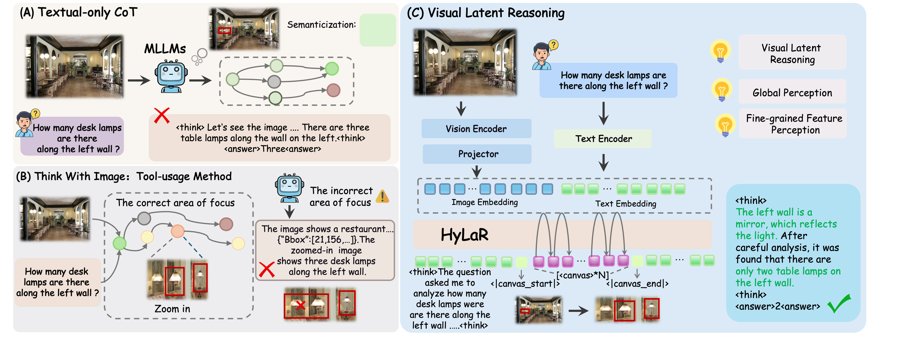

<p align="center">
  <h1 align="center">HyLaR: Hybrid Latent Reasoning with Decoupled Policy Optimization</h1>
  <p align="center">
  </p>
  <p align="center">
    <a href="">Tao Cheng</a>,
    <a href="">Shi-Zhe Chen</a>,
    <a href="">Hao Zhang</a>,
    <a href="">Yixin Qin</a>,
    <a href="">Jinwen Luo</a>,
    <a href="">Zheng Wei</a>
  </p>
  <p align="center">
    <a href="https://arxiv.org/abs/2604.20328">
      
    </a>
    <a href="https://huggingface.co/TencentBAC/HyLaR-Qwen2.5-VL-7B" target="_blank" rel="noopener noreferrer">
      
    </a>
    <a href="https://huggingface.co/datasets/multimodal-reasoning-lab/Zebra-CoT" target="_blank">
      
    </a>
    <a href="https://huggingface.co/datasets/xxx/HyLaR-RL-Data" target="_blank">
      
    </a>
  </p>
</p>

<p align="center">
    
</p>

We introduce <b>HyLaR</b>, a training framework that enables multimodal large language models (MLLMs) to perform <b>hybrid latent reasoning</b> — combining textual chain-of-thought with continuous visual latent representations. HyLaR introduces a <b>Canvas-in-Latents</b> mechanism during supervised fine-tuning and a <b>Decoupled Hybrid PPO</b> algorithm during reinforcement learning, allowing the model to seamlessly interleave discrete text reasoning and continuous latent visual thinking.
<br>

## 🔥Updates
* **2026.4.21** Initial release of HyLaR codebase, including SFT training, RL training, evaluation scripts and model checkpoints.

## 🔍Overview
<details open="open" style='padding: 10px; border-radius:5px 30px 30px 5px; border-style: solid; border-width: 1px;'>
  <summary>Table of Contents</summary>
  <ol>
    <li>
      <a href="#installation">Installation</a>
    </li>
    <li>
      <a href="#sft-training">SFT Training</a>
    </li>
    <li>
      <a href="#rl-training">RL Training</a>
    </li>
    <li>
      <a href="#inference--evaluation">Inference & Evaluation</a>
    </li>
    <li>
      <a href="#citation">Citation</a>
    </li>
    <li>
      <a href="#acknowledgement">Acknowledgement</a>
    </li>
  </ol>
</details>

HyLar is built on top of **Qwen2.5-VL-7B** with customized forward passes in both Transformers and vLLM to support latent reasoning.

* [Modified Transformers forward (for SFT Training)](./SFT/src/train/monkey_patch_forward_canvas.py)
* [Modified Transformers forward (for RL Training)](./RL/src/train/monkey_patch_forward_hylar.py)
* [Modified vLLM model runner (for RL Rollout)](./RL/hylar_models/vllm/hylar_gpu_model_runner.py)

## ⚙Installation

```bash
git clone https://github.com/EthenCheng/HyLar.git
```

### SFT Environment

```bash
conda create -n hylar-sft python=3.10
conda activate hylar-sft
cd HyLar/SFT
pip install -r requirements.txt
pip install qwen-vl-utils
pip install flash-attn --no-build-isolation
```

### RL Environment

```bash
cd HyLar/RL
conda env create -f environment.yml
```


## 🔧SFT Training

### Canvas-in-Latents

The SFT stage teaches the model to reason with **Canvas-in-Latents** — injecting continuous visual representations into the reasoning trace:

- Special tokens `<|canvas|>`, `<|canvas_start|>`, `<|canvas_end|>` are added to the tokenizer.
- A **frozen vision encoder** (SigLIP2) extracts patch features, which are projected to the LLM hidden dimension via a trainable linear projector.


### Training Script

See [train_canvas.sh](./SFT/scripts/train_canvas.sh). 

```bash
cd SFT
bash scripts/train_canvas.sh
```

### Implementation Details

The training requires monkey-patching the official Qwen2.5-VL forward pass, implemented in [monkey_patch_forward_canvas.py](./SFT/src/train/monkey_patch_forward_canvas.py). The patched forward injects canvas hidden states at designated positions and computes the canvas reconstruction loss alongside the standard language modeling loss.


## 🚀RL Training

### Training Script

See [vlpo_train.sh](./RL/examples/vlpo_train.sh).

```bash
cd RL
bash examples/vlpo_train.sh
```

### Model Merging

After training, merge FSDP sharded checkpoints into a single HuggingFace model:

```bash
bash examples/merge_model.sh
```

### API Judge

For reward computation, HyLaR uses GPT-5 (via OpenAI ChatGPT API) as an LLM-as-judge. Configure the API credentials:

```bash
export OPENAI_API_KEY="sk-your-api-key"
export OPENAI_BASE_URL="https://api.openai.com/v1"
```

In the training script, the judge model is specified as:
- `worker.rule_based_judge.api_name=gpt-5`
- `worker.rule_based_judge.api_url=https://api.openai.com/v1`
- `worker.rule_based_judge.api_key=${OPENAI_API_KEY}`


## ⭐Inference & Evaluation

### Multi-GPU Evaluation

HyLaR supports multi-GPU parallel inference with configurable latent reasoning depth.

See [run_eval_HyLar.sh](./Evaluate/run_eval_HyLar.sh):

```bash
bash Evaluate/run_eval_HyLar.sh
```

### LLM-as-Judge Accuracy Scoring

For more accurate evaluation, HyLaR supports API-based accuracy judging as a supplement to rule-based matching:

```bash
export OPENAI_API_KEY="your_api_key"
export OPENAI_BASE_URL="http://your-endpoint/v1"  # optional, for compatible endpoints
python Evaluate/Accuracy_judge.py --input_path <results.json> --output_path <judged_results.json>
```

## 🖊Citation

If you find this work useful, please cite our paper:

```bibtex
@misc{cheng2026hybridlatentreasoningdecoupled,
      title={Hybrid Latent Reasoning with Decoupled Policy Optimization}, 
      author={Tao Cheng and Shi-Zhe Chen and Hao Zhang and Yixin Qin and Jinwen Luo and Zheng Wei},
      year={2026},
      eprint={2604.20328},
      archivePrefix={arXiv}
}
```

## 🙏Acknowledgement

We sincerely thank the following great works as they provide valuable code or data for our work:
* [Zebra-CoT](https://huggingface.co/datasets/multimodal-reasoning-lab/Zebra-CoT)
* [DeepEyes](https://huggingface.co/datasets/ChenShawn/DeepEyes-Datasets-47k)
* [Thyme](https://huggingface.co/datasets/yifanzhang114/Thyme-RL)
* [CodeDance](https://huggingface.co/datasets/Peterwatwec/CodeDance-RL)
* [EasyR1](https://github.com/hiyouga/EasyR1)
* [SigLIP2](https://huggingface.co/google/siglip2-so400m-patch14-384)
* [Monet](https://github.com/NOVAglow646/Monet)
* [SkiLa](https://github.com/TungChintao/SkiLa)


